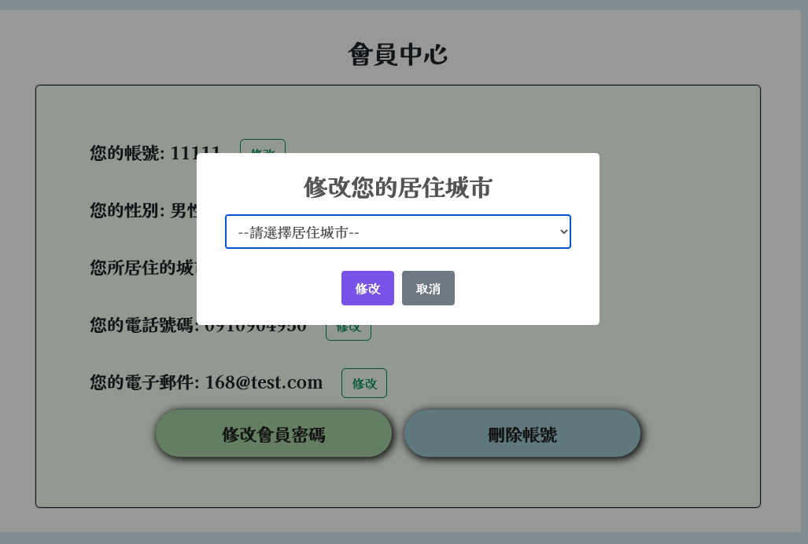

<h1>
植物紀錄網站
</h1>
    <h1>網頁功能</h1>
    <ul>
        <li>使用者</li>
        <ul>
            <li>新增植物(C)</li>
            <li>我的植物(RUD)</li>
            <li>餐飲、口罩地圖</li>
            <li>代辦事項</li>
        </ul>
        <li>管理者</li>
        <ul>
            <li>上述使用者功能</li>
            <li>後臺管理</li>
            <ul>
                <li>使用者資料(可更新、刪除、停權會員)</li>
                <li>數據分析(包括會員相關、植物的數量及加總之報表)</li>
                <li>使用者種植資料(會員植物資料及植物名字、澆花時間、放置地點之報表)</li>
                <li>聯絡內部(管理者資訊)</li>
            </ul>
        </ul>
    </ul>
   <h1>技術內容</h1>
    <ul>
        <li>首頁</li>
        <ol>
            <li>使用ajax實現登入及註冊功能以及串接全台各縣市鄉鎮的API</li>
            <li>使用cookies留存登入資料</li>
            <li>將登入的帳號加在網址後方以實現使用者觀看的獨特性，如:首頁網址＋?username=xxxxx</li>
            <li>使用正規表達式讓網址後方的帳號參數永遠與所登入的帳號同步（也同時解決若把網址參數改掉可登入其他人帳號之問題）</li>
            <li>使用wow.js、Font Awesome及Animate.css製作視覺效果</li>
            <li>使用sweetalert提示未登入網頁</li>
            <li>使用bootstrap5.2的RWD技術</li>
        </ol>
        
        <li>會員中心</li>
        <ol>
            <li>使用ajax串接API取得單一會員資訊</li>
            <li>使用sweetalert串接API修改會員資料並在修改後加上setTimeout延遲幾秒後再跳回原頁面</li>
        </ol>
        
        <li>餐飲地圖及口罩地圖</li>
        <ol>
            <li>使用ajax串接餐飲和口罩資料以及台灣各縣市鄉鎮的API</li>
            <li>使用leftlet完成地圖大致樣貌</li>
            <li>使用MarkerClusterGroup群聚個不同大小的範圍</li>
            <li>使用HTML5 Geolocation API取得目前所在位置並定位</li>
        </ol>
        
        <li>後台管理-數據分析</li>
        <ul>
            <li>使用chart.js製作報表包括</li>
            <ul>
                <li>會員總數、啟用和停權人數</li>
                <li>性別統計、居住地統計</li>
                <li>單一會員植物數量比較</li>
                <li>單一會員植物加總之數量比較</li>
            </ul>
        </ul>
        
    </ul>
