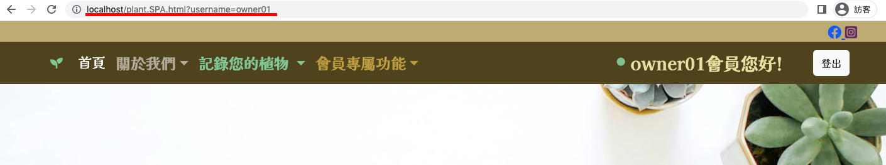
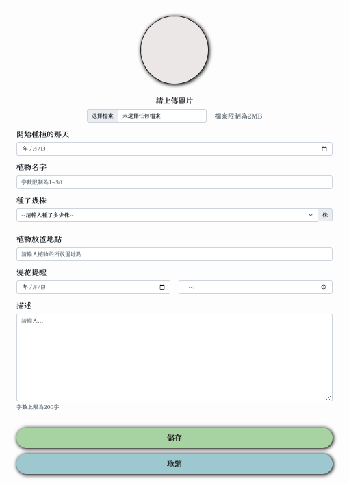
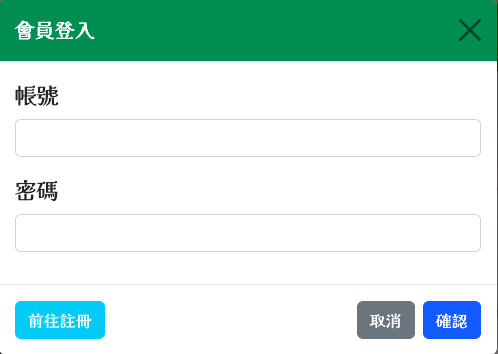
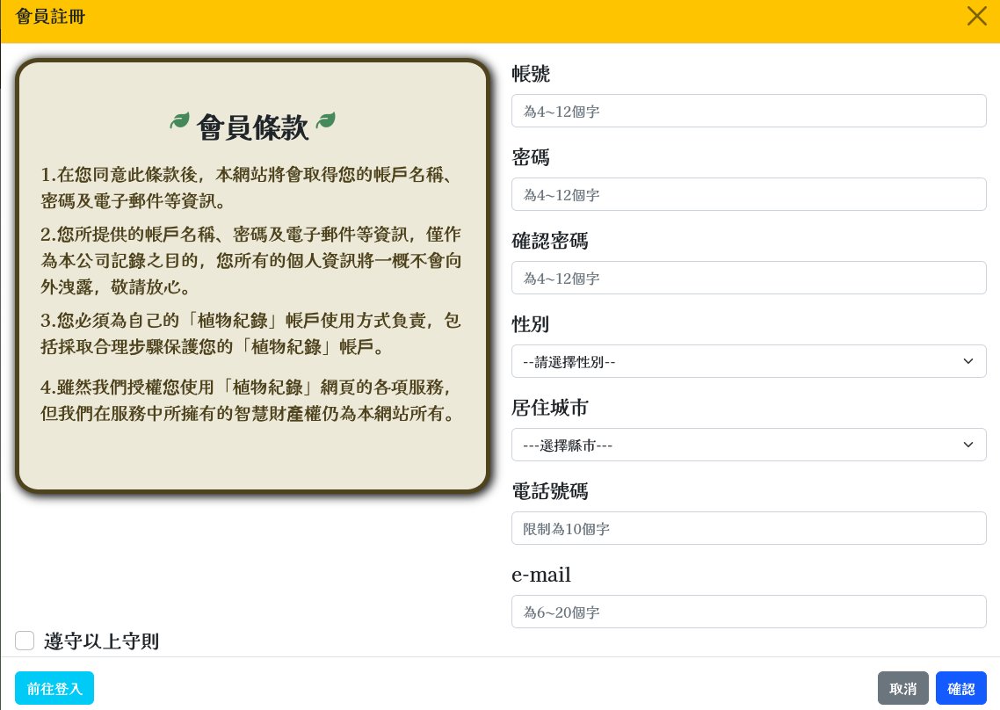
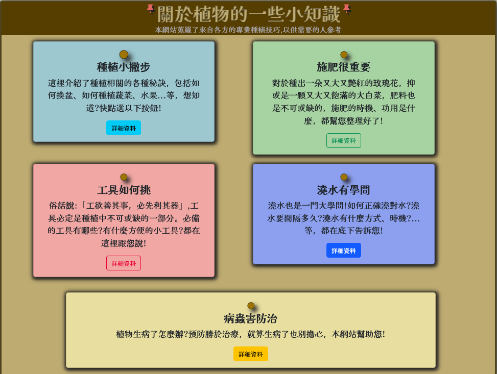
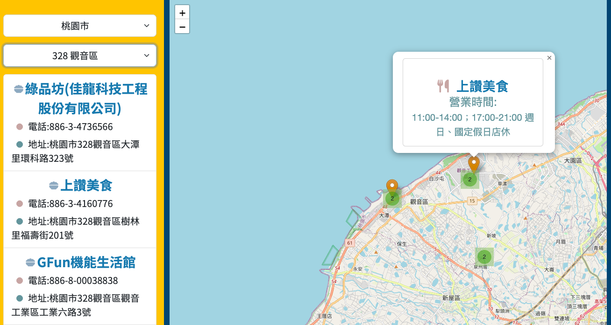
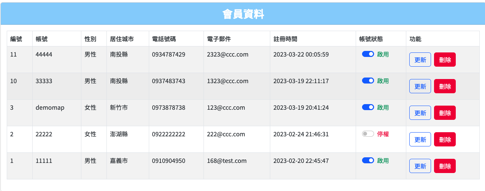
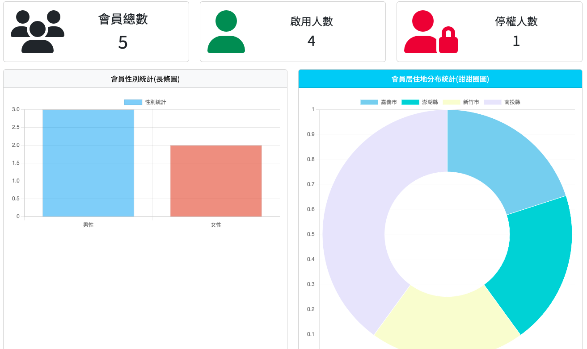
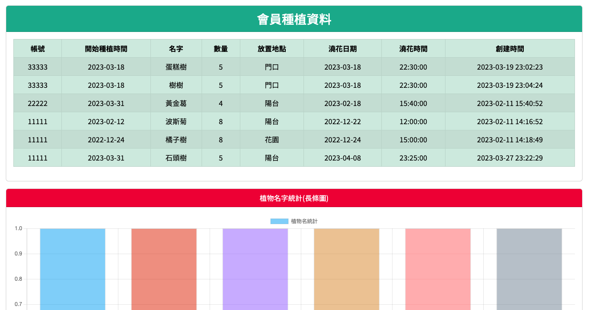

<h1>
植物紀錄網站
</h1>
    <h1>網頁功能</h1>
    <ul>
        <li>使用者</li>
        <ul>
            <li>新增植物(C)</li>
            <li>我的植物(RUD)</li>
            <li>餐飲、口罩地圖</li>
            <li>代辦事項</li>
        </ul>
        <li>管理者</li>
        <ul>
            <li>上述使用者功能</li>
            <li>後臺管理</li>
            <ul>
                <li>使用者資料(可更新、刪除、停權會員)</li>
                <li>數據分析(包括會員相關、植物的數量及加總之報表)</li>
                <li>使用者種植資料(會員植物資料及植物名字、澆花時間、放置地點之報表)</li>
                <li>聯絡內部(管理者資訊)</li>
            </ul>
        </ul>
    </ul>
    <h1>內容展示</h1>
    <ul>
        <li><h3>使用者</h3></li>
        <ul>
            <li>
                <h3>首頁</h3>
            </li>
            
<pre><code>未登入：出現警示訊息未登入，無法紀錄植物  
已登入（啟用）：記錄我的植物列表、口罩地圖、待辦事項皆可使用  
已登入（停權）：不得新增植物、會員中心顯示停權且不得修改
</code></pre>

            
            <li>
                <h3>新增植物</h3>
            </li>
             
<pre><code>共有圖片、種植日期、名字、數量、地點、澆花日期、時間、描述等8個欄位</code></pre>

            
              
            
            
            <li>
                <h3>種植小知識</h3>
            </li>
             
<pre><code>共有五大類之植物知識(目前暫無進階功能)</code></pre>

            
            <li>
                <h3>餐飲地圖</h3>
            </li>
            <a href="https://data.gov.tw/dataset/7779">引用政府資料開放平臺- 餐飲 - 觀光資訊資料庫</a>   
            
        </ul>
        <li><h3>管理者</h3></li>
        
<pre><code>未登入：出現警示訊息未登入，無法紀錄植物也無法進入後台管理  
已登入（啟用）：記錄我的植物列表、口罩、餐飲地圖、待辦事項皆可使用，也可使用後台管理系統的全部頁面  
已登入（停權）：會員中心顯示停權且不得修改、因停權無法進入後台管理系統
</code></pre>

            <ul>
                <li>
                <h3>使用者資料</h3>
                </li>
                 
<pre><code>可看到全部使用者的資料且可停權、啟用、修改、刪除（除了密碼以外）</code></pre>

                
                <li>
                <h3>數據分析</h3>
                </li>
                 
<pre><code>會員相關資料分析（包括會員總數、狀態、性別、居住地、植物數量和總數）</code></pre>

                 
                <li>
                <h3>會員種植資料</h3>
                </li>
                 
<pre><code>包括所有會員的植物資料和植物名字、澆花時間、放置地點之報表分析</code></pre>

                 
            </ul>
    </ul>
