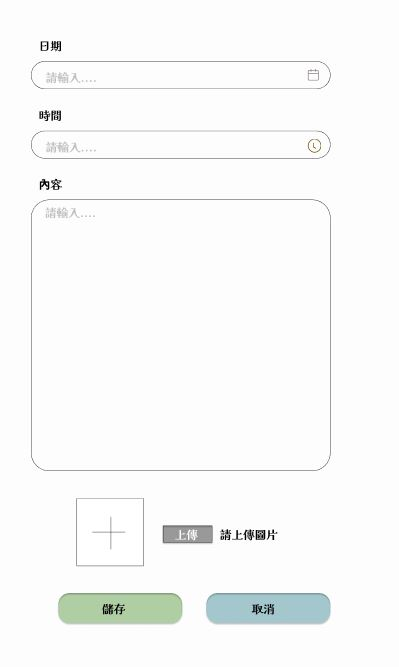

<h1>
植物紀錄網站
</h1>
    <h1>網頁功能</h1>
    <ul>
        <li>使用者</li>
        <ul>
            <li>新增植物(單一檔案上傳)</li>
            <li>我的植物</li>
            <li>餐飲、口罩地圖</li>
            <li>代辦事項</li>
        </ul>
        <li>管理者</li>
        <ul>
            <li>上述使用者功能</li>
            <li>後臺管理</li>
            <ul>
                <li>使用者資料(可更新、刪除、停權會員)</li>
                <li>數據分析(包括會員相關、植物的數量及加總之報表)</li>
                <li>使用者種植資料(會員植物資料及植物名字、澆花時間、放置地點之報表)</li>
                <li>聯絡內部(管理者資訊)</li>
            </ul>
        </ul>
    </ul>
    <h1>未做部分</h1>
    <ul>
        <li>植物日記CRUD(多重檔案上傳)</li>
        
大致上的樣式如下圖:

        
        <li>種植小知識</li>
        <li>後臺管理-合作對象</li>
    </ul>
